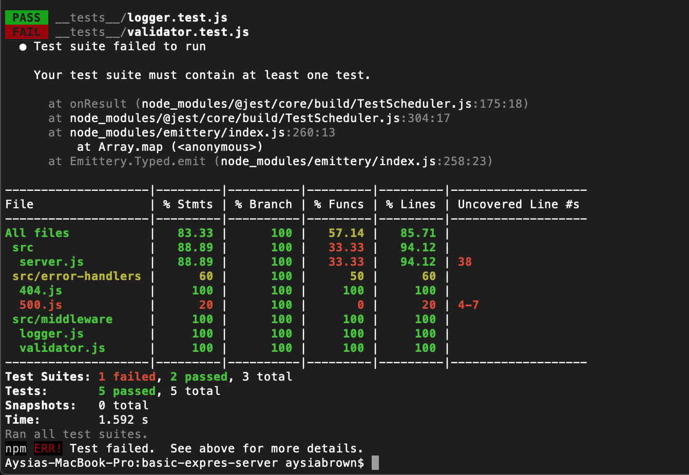
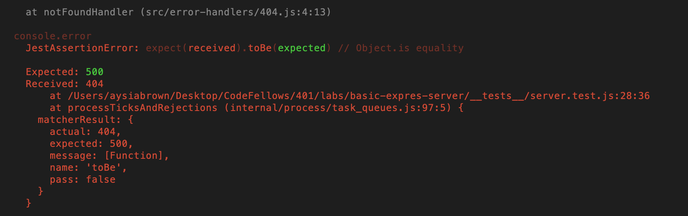
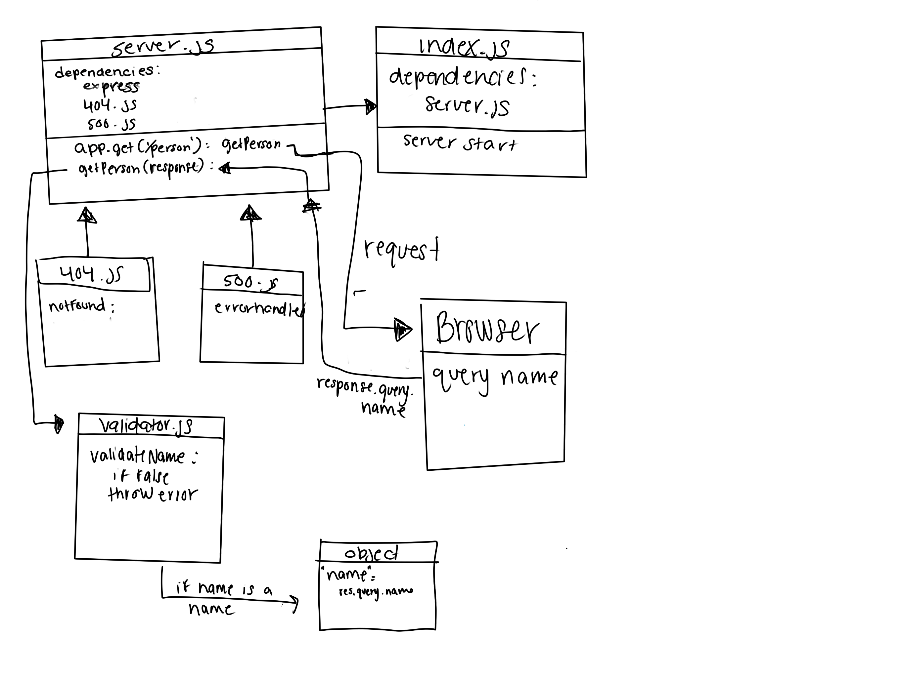

# Lab - Class 02
## Basic Express Server
### Author: Aysia Brown

### Links & Resources
- [CI/CD](https://github.com/aysiabrown-401d39-advanced-javascript/basic-expres-server/actions/new)
- [Deployed Backend](https://aysiab-basic-express-server.herokuapp.com/)
- Deployed Frontend Not Applicable

### Setup
- when running from your local machine, install dependencies from package.json using `npm i` within the repository from your terminal.

### `.env` requirements
- PORT : port number

### Initialize & Run Instructions:
- launch local server using nodemon or node index.js
- server is innately set to run at `localhost:3001` 

## Libraries
- supertest to run a mock server
- jest is a testing library 

### Tests:
- Testing for:
    - 404 on a bad route
    - 404 on a bad method
    - 500 if no name in the query string*
    - 200 if the name is in the query string
    - given a name in the query string, the output object is correct
    - logger middleware responding correctly
- Test needing to be written:
    - validator tests 
- Additional testing notes:
    - test for 500 if no name is in query string returns a 404 instead. Requires additional troubleshooting before moving into testing validator.*

Testing Suite

500 test failing for 404*

### UML
